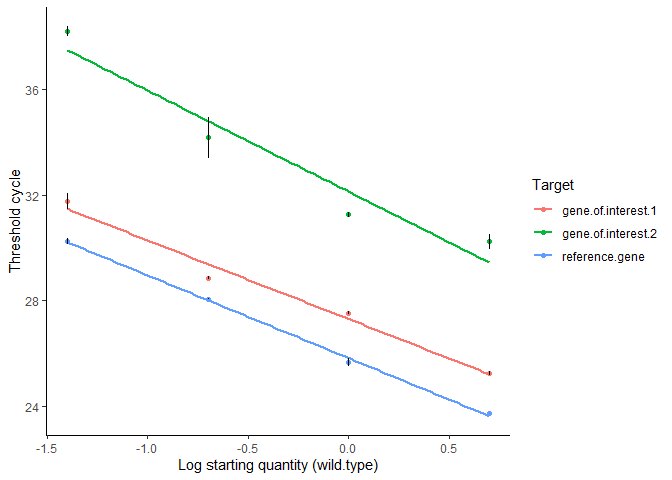
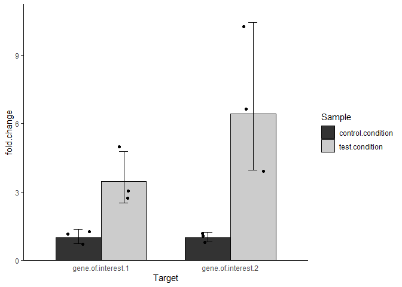

<!-- README.md is generated from README.Rmd. Please edit that file -->

# qPCR.CFX.process

<!-- badges: start -->
<!-- badges: end -->

The goal of the R package `qPCR.CFX.process` is to facilitate the
processing of real-time quantitative PCR results, exported by the
Bio-Rad CFX Connect software. It is meant for relative quantification of
target genes, and supports one or multiple reference genes.

Its input is calculated quantification cycle (Cq) values and its output
is relative quantity to a designated control sample. If standard curve
reactions are included, primer efficiencies are calculated and the
method established by [Pfaffl (2001)](#ref1) is applied to calculate
relative quantity, using the *common base* calculation approach,
described by [Ganger et al. (2017)](#ref2). Otherwise, the [Livak and
Schmittgen (2001)](#ref3) method is applied, assuming all primer
efficiencies to be equal to 100%.

## Installation

You can install the `qPCR.CFX.process` package from
[GitHub](https://github.com/) by using the `devtools` package. If
`devtools` is not installed in your system, install it with the
following line:

``` r
install.packages("devtools")
```

When `devtools` is installed, run the following line to install the
`qPCR.CFX.process` package:

``` r
devtools::install_github("dimitriskokoretsis/qPCR.CFX.process")
```

## Setting up the real-time qPCR run

The `qPCR.CFX.process` package makes certain assumptions about the
structure of the data. Naming conventions in your setup should comply
with these assumptions. The following rules should be followed:

-   Primer efficiencies are calculated from standard curves, based on
    serial dilutions of the template. The starting quantity input by the
    user is in arbitrary units, but the dilution rate is important. For
    example, input starting quantities of 5, 1, 0.2 and 0.04 should give
    the same efficiency results as 10, 2, 0.4 and 0.08 (both describe a
    dilution rate of 5).

-   The “sample” field is used both for the name of the reaction
    template and for its biological replicate number. The biological
    replicate number should come last and be separated with a space from
    the sample’s name. For example: “template name X”, where X is the
    biological replicate number. Sample name doesn’t matter for
    calculations in standard curve reactions, as the same template is
    always used. Use a descriptive name for your convenience.

-   Technical replicates should have the exact same names in all fields.
    They are essentially copies of the same reaction and their Cq values
    will be averaged.

## Example

We will demonstrate the functionality of `qPCR.CFX.process` with an
example real-time qPCR result. In this mock experiment, the expression
of **2 genes of interest** is measured on a **test condition**, in
relation to a **control condition**. There are **3 biological
replicates** for each condition and **one reference gene** is used.

### Import real-time qPCR results to the R environment

The Bio-Rad CFX software exports a number of different comma-separated
files (.csv extension) per run. `qPCR.CFX.process` handles the file
whose name ends in “Quantification Cq Results_0.csv”. This file contains
information on type of reaction, sample, amplification target, and
calculated quantification cycle (Cq) per well.

There are different ways to import a CSV file into the R environment. We
will use the `fread` function of the `data.table` package to import the
data in a `data.table`, which we will call `Cq.data`.

``` r
# Import data from file
Cq.data <- data.table::fread("test_data/username_date_time_model - Quantification Cq Results_0.csv",check.names=TRUE)

# Display data
knitr::kable(Cq.data)
```

| Target             | Content | Sample              |       Cq | Starting.Quantity..SQ. | Log.Starting.Quantity |
|:-------------------|:--------|:--------------------|---------:|-----------------------:|----------------------:|
| gene.of.interest.1 | Std     | wild.type           | 25.31687 |                   5.00 |               0.69897 |
| gene.of.interest.1 | Std     | wild.type           | 25.18056 |                   5.00 |               0.69897 |
| gene.of.interest.1 | Std     | wild.type           | 25.20548 |                   5.00 |               0.69897 |
| gene.of.interest.1 | Std     | wild.type           | 27.47060 |                   1.00 |               0.00000 |
| gene.of.interest.1 | Std     | wild.type           | 27.59993 |                   1.00 |               0.00000 |
| gene.of.interest.1 | Std     | wild.type           | 27.50947 |                   1.00 |               0.00000 |
| gene.of.interest.1 | Std     | wild.type           | 28.81033 |                   0.20 |              -0.69897 |
| gene.of.interest.1 | Std     | wild.type           | 28.91089 |                   0.20 |              -0.69897 |
| gene.of.interest.1 | Std     | wild.type           | 28.83967 |                   0.20 |              -0.69897 |
| gene.of.interest.1 | Std     | wild.type           | 32.07517 |                   0.04 |              -1.39794 |
| gene.of.interest.1 | Std     | wild.type           | 31.47049 |                   0.04 |              -1.39794 |
| gene.of.interest.1 | Std     | wild.type           | 31.70834 |                   0.04 |              -1.39794 |
| gene.of.interest.1 | NTC     |                     | 34.98170 |                    NaN |                   NaN |
| gene.of.interest.2 | Std     | wild.type           | 29.90019 |                   5.00 |               0.69897 |
| gene.of.interest.2 | Std     | wild.type           | 30.45874 |                   5.00 |               0.69897 |
| gene.of.interest.2 | Std     | wild.type           | 30.32889 |                   5.00 |               0.69897 |
| gene.of.interest.2 | Std     | wild.type           | 31.36213 |                   1.00 |               0.00000 |
| gene.of.interest.2 | Std     | wild.type           | 31.18277 |                   1.00 |               0.00000 |
| gene.of.interest.2 | Std     | wild.type           | 31.21550 |                   1.00 |               0.00000 |
| gene.of.interest.2 | Std     | wild.type           | 34.91536 |                   0.20 |              -0.69897 |
| gene.of.interest.2 | Std     | wild.type           | 33.36605 |                   0.20 |              -0.69897 |
| gene.of.interest.2 | Std     | wild.type           | 34.25686 |                   0.20 |              -0.69897 |
| gene.of.interest.2 | Std     | wild.type           | 38.33584 |                   0.04 |              -1.39794 |
| gene.of.interest.2 | Std     | wild.type           | 37.99009 |                   0.04 |              -1.39794 |
| gene.of.interest.2 | Std     | wild.type           | 38.26446 |                   0.04 |              -1.39794 |
| gene.of.interest.2 | NTC     |                     |      NaN |                    NaN |                   NaN |
| reference.gene     | Std     | wild.type           | 23.72250 |                   5.00 |               0.69897 |
| reference.gene     | Std     | wild.type           | 23.72578 |                   5.00 |               0.69897 |
| reference.gene     | Std     | wild.type           | 23.71567 |                   5.00 |               0.69897 |
| reference.gene     | Std     | wild.type           | 25.80885 |                   1.00 |               0.00000 |
| reference.gene     | Std     | wild.type           | 25.51385 |                   1.00 |               0.00000 |
| reference.gene     | Std     | wild.type           | 25.61845 |                   1.00 |               0.00000 |
| reference.gene     | Std     | wild.type           | 28.08328 |                   0.20 |              -0.69897 |
| reference.gene     | Std     | wild.type           | 28.02725 |                   0.20 |              -0.69897 |
| reference.gene     | Std     | wild.type           | 28.04874 |                   0.20 |              -0.69897 |
| reference.gene     | Std     | wild.type           | 30.36816 |                   0.04 |              -1.39794 |
| reference.gene     | Std     | wild.type           | 30.14619 |                   0.04 |              -1.39794 |
| reference.gene     | Std     | wild.type           | 30.19956 |                   0.04 |              -1.39794 |
| reference.gene     | NTC     |                     |      NaN |                    NaN |                   NaN |
| gene.of.interest.1 | Unkn    | control.condition 1 | 28.10107 |                    NaN |                   NaN |
| gene.of.interest.1 | Unkn    | control.condition 1 | 28.00969 |                    NaN |                   NaN |
| gene.of.interest.1 | Unkn    | control.condition 1 | 27.97419 |                    NaN |                   NaN |
| gene.of.interest.1 | Unkn    | control.condition 2 | 28.18124 |                    NaN |                   NaN |
| gene.of.interest.1 | Unkn    | control.condition 2 | 27.92769 |                    NaN |                   NaN |
| gene.of.interest.1 | Unkn    | control.condition 2 | 27.58434 |                    NaN |                   NaN |
| gene.of.interest.1 | Unkn    | control.condition 3 | 28.97493 |                    NaN |                   NaN |
| gene.of.interest.1 | Unkn    | control.condition 3 | 28.23828 |                    NaN |                   NaN |
| gene.of.interest.1 | Unkn    | control.condition 3 | 28.33302 |                    NaN |                   NaN |
| gene.of.interest.1 | Unkn    | test.condition 1    | 26.84763 |                    NaN |                   NaN |
| gene.of.interest.1 | Unkn    | test.condition 1    | 26.19705 |                    NaN |                   NaN |
| gene.of.interest.1 | Unkn    | test.condition 1    | 26.75797 |                    NaN |                   NaN |
| gene.of.interest.1 | Unkn    | test.condition 2    | 26.59074 |                    NaN |                   NaN |
| gene.of.interest.1 | Unkn    | test.condition 2    | 26.43531 |                    NaN |                   NaN |
| gene.of.interest.1 | Unkn    | test.condition 2    | 25.85585 |                    NaN |                   NaN |
| gene.of.interest.1 | Unkn    | test.condition 3    | 27.03001 |                    NaN |                   NaN |
| gene.of.interest.1 | Unkn    | test.condition 3    | 27.24894 |                    NaN |                   NaN |
| gene.of.interest.1 | Unkn    | test.condition 3    | 26.70993 |                    NaN |                   NaN |
| gene.of.interest.2 | Unkn    | control.condition 1 | 34.68549 |                    NaN |                   NaN |
| gene.of.interest.2 | Unkn    | control.condition 1 | 34.81189 |                    NaN |                   NaN |
| gene.of.interest.2 | Unkn    | control.condition 1 | 34.96419 |                    NaN |                   NaN |
| gene.of.interest.2 | Unkn    | control.condition 2 | 35.28110 |                    NaN |                   NaN |
| gene.of.interest.2 | Unkn    | control.condition 2 | 35.53064 |                    NaN |                   NaN |
| gene.of.interest.2 | Unkn    | control.condition 2 | 34.70007 |                    NaN |                   NaN |
| gene.of.interest.2 | Unkn    | control.condition 3 | 34.62332 |                    NaN |                   NaN |
| gene.of.interest.2 | Unkn    | control.condition 3 | 34.65434 |                    NaN |                   NaN |
| gene.of.interest.2 | Unkn    | control.condition 3 | 34.62697 |                    NaN |                   NaN |
| gene.of.interest.2 | Unkn    | test.condition 1    | 31.41039 |                    NaN |                   NaN |
| gene.of.interest.2 | Unkn    | test.condition 1    | 32.10934 |                    NaN |                   NaN |
| gene.of.interest.2 | Unkn    | test.condition 1    | 31.24901 |                    NaN |                   NaN |
| gene.of.interest.2 | Unkn    | test.condition 2    | 31.15962 |                    NaN |                   NaN |
| gene.of.interest.2 | Unkn    | test.condition 2    | 31.39998 |                    NaN |                   NaN |
| gene.of.interest.2 | Unkn    | test.condition 2    | 31.31049 |                    NaN |                   NaN |
| gene.of.interest.2 | Unkn    | test.condition 3    | 32.92115 |                    NaN |                   NaN |
| gene.of.interest.2 | Unkn    | test.condition 3    | 32.63306 |                    NaN |                   NaN |
| gene.of.interest.2 | Unkn    | test.condition 3    | 32.83479 |                    NaN |                   NaN |
| reference.gene     | Unkn    | control.condition 1 | 25.70499 |                    NaN |                   NaN |
| reference.gene     | Unkn    | control.condition 1 | 25.77324 |                    NaN |                   NaN |
| reference.gene     | Unkn    | control.condition 1 | 26.01208 |                    NaN |                   NaN |
| reference.gene     | Unkn    | control.condition 2 | 25.57582 |                    NaN |                   NaN |
| reference.gene     | Unkn    | control.condition 2 | 25.47155 |                    NaN |                   NaN |
| reference.gene     | Unkn    | control.condition 2 | 25.68859 |                    NaN |                   NaN |
| reference.gene     | Unkn    | control.condition 3 | 25.42625 |                    NaN |                   NaN |
| reference.gene     | Unkn    | control.condition 3 | 25.62250 |                    NaN |                   NaN |
| reference.gene     | Unkn    | control.condition 3 | 25.60219 |                    NaN |                   NaN |
| reference.gene     | Unkn    | test.condition 1    | 25.53302 |                    NaN |                   NaN |
| reference.gene     | Unkn    | test.condition 1    | 25.68075 |                    NaN |                   NaN |
| reference.gene     | Unkn    | test.condition 1    | 25.43289 |                    NaN |                   NaN |
| reference.gene     | Unkn    | test.condition 2    | 25.67935 |                    NaN |                   NaN |
| reference.gene     | Unkn    | test.condition 2    | 25.92961 |                    NaN |                   NaN |
| reference.gene     | Unkn    | test.condition 2    | 26.08242 |                    NaN |                   NaN |
| reference.gene     | Unkn    | test.condition 3    | 25.50338 |                    NaN |                   NaN |
| reference.gene     | Unkn    | test.condition 3    | 25.83698 |                    NaN |                   NaN |
| reference.gene     | Unkn    | test.condition 3    | 26.08465 |                    NaN |                   NaN |

The `check.names=TRUE` argument of `fread` converts the spaces to dots
in the field names, to minimize downstream processing errors. Each row
(record) of the table corresponds to a single well, and each column
(field) represents the following information:

-   `Target`: The gene being amplified - essentially, the primer pair
    used in the reaction.

-   `Content`: The type of reaction. It is set during setup with the
    Bio-Rad CFX Connect software and can have one of 3 values:

    -   “NTC”: non-template control

    -   “Std”: standard curve reaction

    -   “Unkn”: unknown sample reaction

-   `Sample`: The reaction template and its biological replicate number.

-   `Cq`: The calculated quantification cycle of the reaction.

-   `Starting.Quantity..SQ`: Only for standard curve reactions, the
    template’s starting quantity as was input during reaction setup.

-   `Log.Starting.Quantity`: Only for standard curve reactions, the
    base-10 logarithm of the starting quantity.

Actual exported files from Bio-Rad CFX connector contain more fields,
but this is all the information needed for the expression analysis.

### Process real-time qPCR results

To process the imported results, load the `qPCR.CFX.process` package and
feed the primary data to the `qPCR_analysis_wrap` function. This will
perform the whole processing in one go. Set the arguments `refgene` to
the name of your reference gene and `control` to the name of your
control condition.

``` r
# Load the qPCR.CFX.process package
library(qPCR.CFX.process)

# Process qPCR results and store them in the qPCR.analysis variable as a list
qPCR.analysis <- Cq.data |>
  qPCR_analysis_wrap(refgene="reference.gene",
                     control="control.condition")
```

The qPCR results have now been processed and are contained in a list
named `qPCR.analysis`.

### Investigate real-time qPCR results

To check the contents of `qPCR.analysis`, you can use the `str` function
(as in “structure”). The `max.level` argument is set to 1, to only show
the first level of the list’s structure.

``` r
str(qPCR.analysis,max.level=1)
#> List of 4
#>  $ NTC       :Classes 'data.table' and 'data.frame': 3 obs. of  2 variables:
#>   ..- attr(*, ".internal.selfref")=<externalptr> 
#>  $ std.curve :List of 3
#>  $ unk.rxn   :Classes 'data.table' and 'data.frame': 18 obs. of  5 variables:
#>   ..- attr(*, ".internal.selfref")=<externalptr> 
#>  $ expression:Classes 'data.table' and 'data.frame': 12 obs. of  14 variables:
#>   ..- attr(*, ".internal.selfref")=<externalptr>
```

Therefore, the `qPCR.analysis` list has 4 elements:

-   `NTC`: A `data.table` with primer targets and Cq values, each row
    being a non-template control reaction.

-   `std.curve`: A list of 3 elements. See [Standard curve
    calculations](#standard-curve-calculations) section for more
    details.

-   `unk.rxn`: A `data.table` with Cq values for each sample, biological
    replicate and gene.

-   `expression`: A `data.table` with the calculated expression of each
    sample, biological replicate and target gene.

#### Non-template controls

To see the `NTC` `data.table` of the `qPCR.analysis` list, call it as
follows:

``` r
# Display NTC data.table
knitr::kable(qPCR.analysis$NTC)
```

| Target             |      Cq |
|:-------------------|--------:|
| gene.of.interest.1 | 34.9817 |
| gene.of.interest.2 |     NaN |
| reference.gene     |     NaN |

As we see, the non-template control reaction for gene.of.interest.1 has
a Cq value of 34.9817 - while the other two non-template control
reactions did not yield a Cq value (`NaN` - not a number).

Ideally, all three should be `NaN`. However, as the Cq value is quite
high, we can move forward.

#### Standard curve calculations

The `std.curve` element of the `qPCR.analysis` list contains the results
of standard curve reactions and primer efficiencies and is itself a list
of 3 elements. We can check its structure as follows:

``` r
str(qPCR.analysis$std.curve,max.level=1)
#> List of 3
#>  $ data        :Classes 'data.table' and 'data.frame':   12 obs. of  5 variables:
#>   ..- attr(*, ".internal.selfref")=<externalptr> 
#>  $ efficiencies:Classes 'data.table' and 'data.frame':   3 obs. of  4 variables:
#>   ..- attr(*, ".internal.selfref")=<externalptr> 
#>   ..- attr(*, "index")= int(0) 
#>   .. ..- attr(*, "__Target")= int(0) 
#>  $ plot        :List of 9
#>   ..- attr(*, "class")= chr [1:2] "gg" "ggplot"
```

-   `data`: A `data.table` with the Cq values against log(Starting
    quantity) for each target gene.

-   `efficiencies`: A `data.table` with the calculated efficiencies for
    each target gene.

-   `plot`: A `ggplot2`-based scatter plot with drawn standard curves.

``` r
# Display "data" data.table
knitr::kable(qPCR.analysis$std.curve$data)
```

| Target             | Sample    | Log.Starting.Quantity | Cq.average | Cq.st.dev |
|:-------------------|:----------|----------------------:|-----------:|----------:|
| gene.of.interest.1 | wild.type |               0.69897 |   25.23430 | 0.0725828 |
| gene.of.interest.1 | wild.type |               0.00000 |   27.52667 | 0.0663588 |
| gene.of.interest.1 | wild.type |              -0.69897 |   28.85363 | 0.0517143 |
| gene.of.interest.1 | wild.type |              -1.39794 |   31.75134 | 0.3046226 |
| gene.of.interest.2 | wild.type |               0.69897 |   30.22927 | 0.2922996 |
| gene.of.interest.2 | wild.type |               0.00000 |   31.25347 | 0.0955177 |
| gene.of.interest.2 | wild.type |              -0.69897 |   34.17942 | 0.7775525 |
| gene.of.interest.2 | wild.type |              -1.39794 |   38.19680 | 0.1825365 |
| reference.gene     | wild.type |               0.69897 |   23.72132 | 0.0051557 |
| reference.gene     | wild.type |               0.00000 |   25.64705 | 0.1495660 |
| reference.gene     | wild.type |              -0.69897 |   28.05309 | 0.0282636 |
| reference.gene     | wild.type |              -1.39794 |   30.23797 | 0.1158650 |

In the `data` `data.table`, each row corresponds to a target gene and
starting quantity of template. The `Cq.average` and `Cq.st.dev` fields
are the arithmetic mean and standard deviation of technical replicates,
respectively.

``` r
# Display "efficiencies" data.table
knitr::kable(qPCR.analysis$std.curve$efficiencies)
```

| Target             |     slope | efficiency | amplification.base |
|:-------------------|----------:|-----------:|-------------------:|
| gene.of.interest.1 | -2.986975 |  1.1616575 |           2.161658 |
| gene.of.interest.2 | -3.838294 |  0.8219331 |           1.821933 |
| reference.gene     | -3.141194 |  1.0813749 |           2.081375 |

In the `efficiencies` `data.table`, each row corresponds to a target
gene. The `slope` field is the slope of the regression line when Cq is
plotted against log(starting quantity). The `efficiency` field shows the
calculated primer efficiency (1 corresponds to 100%) and
`amplification.base` is the calculated rate of increase per cycle
(efficiency + 1).

``` r
# Display plot
qPCR.analysis$std.curve$plot
#> `geom_smooth()` using formula 'y ~ x'
```



The `plot` element is a scatter plot with quantitation cycle against
log(starting quantity), with regression lines for each target gene. Data
points are the arithmetic means between technical replicates, while
error bars show their standard deviation.

#### Unknown reactions

The `unk.rxn` `data.table` gathers and summarizes the unknown sample
reactions for each target gene, sample, and biological replicate.

``` r
# Display "unk.rxn" data.table
knitr::kable(qPCR.analysis$unk.rxn)
```

| Sample            | Biol.rep | Target             | Cq.tech.mean | Cq.tech.sd |
|:------------------|:---------|:-------------------|-------------:|-----------:|
| control.condition | 1        | gene.of.interest.1 |     28.02832 |  0.0654587 |
| control.condition | 2        | gene.of.interest.1 |     27.89776 |  0.2995715 |
| control.condition | 3        | gene.of.interest.1 |     28.51541 |  0.4007701 |
| test.condition    | 1        | gene.of.interest.1 |     26.60088 |  0.3525901 |
| test.condition    | 2        | gene.of.interest.1 |     26.29397 |  0.3872963 |
| test.condition    | 3        | gene.of.interest.1 |     26.99629 |  0.2710789 |
| control.condition | 1        | gene.of.interest.2 |     34.82052 |  0.1395511 |
| control.condition | 2        | gene.of.interest.2 |     35.17060 |  0.4261706 |
| control.condition | 3        | gene.of.interest.2 |     34.63487 |  0.0169556 |
| test.condition    | 1        | gene.of.interest.2 |     31.58958 |  0.4572979 |
| test.condition    | 2        | gene.of.interest.2 |     31.29003 |  0.1214802 |
| test.condition    | 3        | gene.of.interest.2 |     32.79633 |  0.1478419 |
| control.condition | 1        | reference.gene     |     25.83010 |  0.1612462 |
| control.condition | 2        | reference.gene     |     25.57865 |  0.1085469 |
| control.condition | 3        | reference.gene     |     25.55031 |  0.1079168 |
| test.condition    | 1        | reference.gene     |     25.54889 |  0.1246853 |
| test.condition    | 2        | reference.gene     |     25.89713 |  0.2034858 |
| test.condition    | 3        | reference.gene     |     25.80833 |  0.2916914 |

-   `Sample`: Name of sample template

-   `Biol.rep`: Biological replicate number

-   `Target`: Name of target gene

-   `Cq.tech.mean`: Arithmetic mean between technical replicates

-   `Cq.tech.sd`: Standard deviation between technical replicates

#### Calculated expression

The `expression` `data.table` is the final result of the real-time qPCR
data processing. Each row corresponds to a sample, biological replicate
and gene of interest.

``` r
# Display "expression" data.table
knitr::kable(qPCR.analysis$expression)
```

| Sample            | Biol.rep | Target             | Cq.tech.mean | reference.gene.Cq.tech.mean | reference.gene.amplification.base | reference.gene.Cq.weighed | Ref.Cq.weighed.mean | GOI.amplification.base | GOI.Cq.weighed | DCq.weighed | control.DCq.weighed | log2.fold.change | fold.change |
|:------------------|:---------|:-------------------|-------------:|----------------------------:|----------------------------------:|--------------------------:|--------------------:|-----------------------:|---------------:|------------:|--------------------:|-----------------:|------------:|
| control.condition | 1        | gene.of.interest.1 |     28.02832 |                    25.83010 |                          2.081375 |                  27.31629 |            27.31629 |               2.161658 |       31.17135 |  -3.8550688 |           -4.174510 |        0.3194415 |   1.2478474 |
| control.condition | 2        | gene.of.interest.1 |     27.89776 |                    25.57865 |                          2.081375 |                  27.05037 |            27.05037 |               2.161658 |       31.02616 |  -3.9757904 |           -4.174510 |        0.1987198 |   1.1476795 |
| control.condition | 3        | gene.of.interest.1 |     28.51541 |                    25.55031 |                          2.081375 |                  27.02040 |            27.02040 |               2.161658 |       31.71307 |  -4.6926716 |           -4.174510 |       -0.5181613 |   0.6982612 |
| test.condition    | 1        | gene.of.interest.1 |     26.60088 |                    25.54889 |                          2.081375 |                  27.01889 |            27.01889 |               2.161658 |       29.58385 |  -2.5649640 |           -4.174510 |        1.6095462 |   3.0515584 |
| test.condition    | 2        | gene.of.interest.1 |     26.29397 |                    25.89713 |                          2.081375 |                  27.38716 |            27.38716 |               2.161658 |       29.24252 |  -1.8553562 |           -4.174510 |        2.3191540 |   4.9903951 |
| test.condition    | 3        | gene.of.interest.1 |     26.99629 |                    25.80833 |                          2.081375 |                  27.29326 |            27.29326 |               2.161658 |       30.02360 |  -2.7303406 |           -4.174510 |        1.4441697 |   2.7210618 |
| control.condition | 1        | gene.of.interest.2 |     34.82052 |                    25.83010 |                          2.081375 |                  27.31629 |            27.31629 |               1.821933 |       30.13612 |  -2.8198319 |           -3.054538 |        0.2347063 |   1.1766672 |
| control.condition | 2        | gene.of.interest.2 |     35.17060 |                    25.57865 |                          2.081375 |                  27.05037 |            27.05037 |               1.821933 |       30.43910 |  -3.3887355 |           -3.054538 |       -0.3341973 |   0.7932254 |
| control.condition | 3        | gene.of.interest.2 |     34.63487 |                    25.55031 |                          2.081375 |                  27.02040 |            27.02040 |               1.821933 |       29.97545 |  -2.9550472 |           -3.054538 |        0.0994910 |   1.0713954 |
| test.condition    | 1        | gene.of.interest.2 |     31.58958 |                    25.54889 |                          2.081375 |                  27.01889 |            27.01889 |               1.821933 |       27.33983 |  -0.3209444 |           -3.054538 |        2.7335938 |   6.6511038 |
| test.condition    | 2        | gene.of.interest.2 |     31.29003 |                    25.89713 |                          2.081375 |                  27.38716 |            27.38716 |               1.821933 |       27.08058 |   0.3065821 |           -3.054538 |        3.3611203 |  10.2753832 |
| test.condition    | 3        | gene.of.interest.2 |     32.79633 |                    25.80833 |                          2.081375 |                  27.29326 |            27.29326 |               1.821933 |       28.38424 |  -1.0909790 |           -3.054538 |        1.9635592 |   3.9002299 |

There are many fields in this table to depict calculation stages, but
the most important ones are the following:

-   `Sample`: Name of sample template

-   `Target`: Name of gene of interest

-   `fold.change`: Fold-change of quantity in relation to control sample

### Visualize expression results

We can visualize the fold-change between the control and test conditions
for each gene of interest.

Any visualization tool may be used. The `bar_point_plot` function of the
[`datavis`](https://github.com/dimitriskokoretsis/datavis) package is
quite easy to use for this task. To install it in your system, follow
the instructions in its page.

Importantly, for fold-change of quantity, mean and variation parameters
only make sense in the logarithmic scale. By setting the `mean.type`
argument to “geometric”, the mean and standard deviation are calculated
on log-transformed fold-change and then exponentiated back to their
original scale. These are the *geometric* mean and standard deviation.

``` r
# Load datavis package
library(datavis)

# Create bar plot
expression.plot <- qPCR.analysis$expression |>
  bar_point_plot(x="Target", # X axis grouping based on "Target" field
                 y="fold.change", # Y axis value is "fold.change" field
                 color.group="Sample", # Color grouping based on "Sample" field
                 mean.type="geometric") # Calculate geometric mean and SD, instead of arithmetic

# Show bar plot
expression.plot
```



## References

<a name="ref1">Pfaffl, M.W. (2001). A new mathematical model for
relative quantification in real-time RT–PCR. Nucleic Acids Research, 29
(9), e45. <https://doi.org/10.1093/nar/29.9.e45></a>

<a name="ref2">Ganger, M.T., Dietz, G.D. & Ewing, S.J. (2017). A common
base method for analysis of qPCR data and the application of simple
blocking in qPCR experiments. BMC Bioinformatics, 18.
<https://doi.org/10.1186/s12859-017-1949-5></a>

<a name="ref3">Livak, K.J. & Schmittgen, T.D. (2001). Analysis of
Relative Gene Expression Data Using Real-Time Quantitative PCR and the
2−ΔΔCT Method. Methods, 25 (4), 402–408.
<https://doi.org/10.1006/meth.2001.1262></a>
