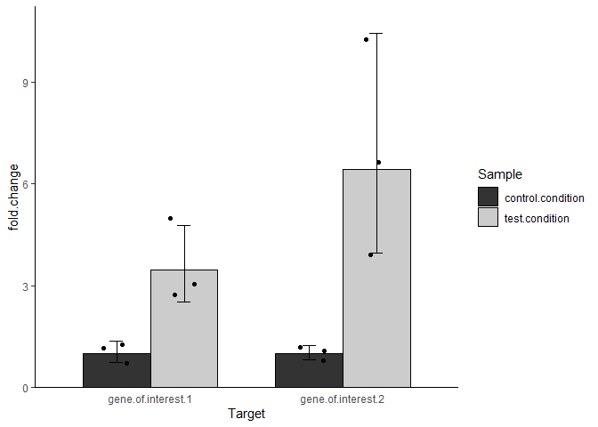

<!-- README.md is generated from README.Rmd. Please edit that file -->

# qpcr.CFX.process

<!-- badges: start -->
<!-- badges: end -->

The goal of qpcr.CFX.process is to …

## Installation

You can install the development version of qpcr.CFX.process from
[GitHub](https://github.com/) with:

``` r
# install.packages("devtools")
devtools::install_github("dimitriskokoretsis/qpcr.CFX.process")
```

## Example

This is a basic example which shows you how to solve a common problem:

``` r
Cq.data <- data.table::fread("test_data/PCR_Cq_data.csv",check.names=TRUE)
knitr::kable(Cq.data)
```

| Target             | Content | Sample                |       Cq | Starting.Quantity..SQ. | Log.Starting.Quantity |
|:-------------------|:--------|:----------------------|---------:|-----------------------:|----------------------:|
| gene.of.interest.1 | Std     | wild.type             | 25.31687 |                   5.00 |               0.69897 |
| gene.of.interest.1 | Std     | wild.type             | 25.18056 |                   5.00 |               0.69897 |
| gene.of.interest.1 | Std     | wild.type             | 25.20548 |                   5.00 |               0.69897 |
| gene.of.interest.1 | Std     | wild.type             | 27.47060 |                   1.00 |               0.00000 |
| gene.of.interest.1 | Std     | wild.type             | 27.59993 |                   1.00 |               0.00000 |
| gene.of.interest.1 | Std     | wild.type             | 27.50947 |                   1.00 |               0.00000 |
| gene.of.interest.1 | Std     | wild.type             | 28.81033 |                   0.20 |              -0.69897 |
| gene.of.interest.1 | Std     | wild.type             | 28.91089 |                   0.20 |              -0.69897 |
| gene.of.interest.1 | Std     | wild.type             | 28.83967 |                   0.20 |              -0.69897 |
| gene.of.interest.1 | Std     | wild.type             | 32.07517 |                   0.04 |              -1.39794 |
| gene.of.interest.1 | Std     | wild.type             | 31.47049 |                   0.04 |              -1.39794 |
| gene.of.interest.1 | Std     | wild.type             | 31.70834 |                   0.04 |              -1.39794 |
| gene.of.interest.1 | NTC     |                       | 34.98170 |                    NaN |                   NaN |
| gene.of.interest.2 | Std     | wild.type             | 29.90019 |                   5.00 |               0.69897 |
| gene.of.interest.2 | Std     | wild.type             | 30.45874 |                   5.00 |               0.69897 |
| gene.of.interest.2 | Std     | wild.type             | 30.32889 |                   5.00 |               0.69897 |
| gene.of.interest.2 | Std     | wild.type             | 31.36213 |                   1.00 |               0.00000 |
| gene.of.interest.2 | Std     | wild.type             | 31.18277 |                   1.00 |               0.00000 |
| gene.of.interest.2 | Std     | wild.type             | 31.21550 |                   1.00 |               0.00000 |
| gene.of.interest.2 | Std     | wild.type             | 34.91536 |                   0.20 |              -0.69897 |
| gene.of.interest.2 | Std     | wild.type             | 33.36605 |                   0.20 |              -0.69897 |
| gene.of.interest.2 | Std     | wild.type             | 34.25686 |                   0.20 |              -0.69897 |
| gene.of.interest.2 | Std     | wild.type             | 38.33584 |                   0.04 |              -1.39794 |
| gene.of.interest.2 | Std     | wild.type             | 37.99009 |                   0.04 |              -1.39794 |
| gene.of.interest.2 | Std     | wild.type             | 38.26446 |                   0.04 |              -1.39794 |
| gene.of.interest.2 | NTC     |                       |      NaN |                    NaN |                   NaN |
| reference.gene     | Std     | wild.type             | 23.72250 |                   5.00 |               0.69897 |
| reference.gene     | Std     | wild.type             | 23.72578 |                   5.00 |               0.69897 |
| reference.gene     | Std     | wild.type             | 23.71567 |                   5.00 |               0.69897 |
| reference.gene     | Std     | wild.type             | 25.80885 |                   1.00 |               0.00000 |
| reference.gene     | Std     | wild.type             | 25.51385 |                   1.00 |               0.00000 |
| reference.gene     | Std     | wild.type             | 25.61845 |                   1.00 |               0.00000 |
| reference.gene     | Std     | wild.type             | 28.08328 |                   0.20 |              -0.69897 |
| reference.gene     | Std     | wild.type             | 28.02725 |                   0.20 |              -0.69897 |
| reference.gene     | Std     | wild.type             | 28.04874 |                   0.20 |              -0.69897 |
| reference.gene     | Std     | wild.type             | 30.36816 |                   0.04 |              -1.39794 |
| reference.gene     | Std     | wild.type             | 30.14619 |                   0.04 |              -1.39794 |
| reference.gene     | Std     | wild.type             | 30.19956 |                   0.04 |              -1.39794 |
| reference.gene     | NTC     |                       |      NaN |                    NaN |                   NaN |
| gene.of.interest.1 | Unkn    | control.condition (1) | 28.10107 |                    NaN |                   NaN |
| gene.of.interest.1 | Unkn    | control.condition (1) | 28.00969 |                    NaN |                   NaN |
| gene.of.interest.1 | Unkn    | control.condition (1) | 27.97419 |                    NaN |                   NaN |
| gene.of.interest.1 | Unkn    | control.condition (2) | 28.18124 |                    NaN |                   NaN |
| gene.of.interest.1 | Unkn    | control.condition (2) | 27.92769 |                    NaN |                   NaN |
| gene.of.interest.1 | Unkn    | control.condition (2) | 27.58434 |                    NaN |                   NaN |
| gene.of.interest.1 | Unkn    | control.condition (3) | 28.97493 |                    NaN |                   NaN |
| gene.of.interest.1 | Unkn    | control.condition (3) | 28.23828 |                    NaN |                   NaN |
| gene.of.interest.1 | Unkn    | control.condition (3) | 28.33302 |                    NaN |                   NaN |
| gene.of.interest.1 | Unkn    | test.condition (1)    | 26.84763 |                    NaN |                   NaN |
| gene.of.interest.1 | Unkn    | test.condition (1)    | 26.19705 |                    NaN |                   NaN |
| gene.of.interest.1 | Unkn    | test.condition (1)    | 26.75797 |                    NaN |                   NaN |
| gene.of.interest.1 | Unkn    | test.condition (2)    | 26.59074 |                    NaN |                   NaN |
| gene.of.interest.1 | Unkn    | test.condition (2)    | 26.43531 |                    NaN |                   NaN |
| gene.of.interest.1 | Unkn    | test.condition (2)    | 25.85585 |                    NaN |                   NaN |
| gene.of.interest.1 | Unkn    | test.condition (3)    | 27.03001 |                    NaN |                   NaN |
| gene.of.interest.1 | Unkn    | test.condition (3)    | 27.24894 |                    NaN |                   NaN |
| gene.of.interest.1 | Unkn    | test.condition (3)    | 26.70993 |                    NaN |                   NaN |
| gene.of.interest.2 | Unkn    | control.condition (1) | 34.68549 |                    NaN |                   NaN |
| gene.of.interest.2 | Unkn    | control.condition (1) | 34.81189 |                    NaN |                   NaN |
| gene.of.interest.2 | Unkn    | control.condition (1) | 34.96419 |                    NaN |                   NaN |
| gene.of.interest.2 | Unkn    | control.condition (2) | 35.28110 |                    NaN |                   NaN |
| gene.of.interest.2 | Unkn    | control.condition (2) | 35.53064 |                    NaN |                   NaN |
| gene.of.interest.2 | Unkn    | control.condition (2) | 34.70007 |                    NaN |                   NaN |
| gene.of.interest.2 | Unkn    | control.condition (3) | 34.62332 |                    NaN |                   NaN |
| gene.of.interest.2 | Unkn    | control.condition (3) | 34.65434 |                    NaN |                   NaN |
| gene.of.interest.2 | Unkn    | control.condition (3) | 34.62697 |                    NaN |                   NaN |
| gene.of.interest.2 | Unkn    | test.condition (1)    | 31.41039 |                    NaN |                   NaN |
| gene.of.interest.2 | Unkn    | test.condition (1)    | 32.10934 |                    NaN |                   NaN |
| gene.of.interest.2 | Unkn    | test.condition (1)    | 31.24901 |                    NaN |                   NaN |
| gene.of.interest.2 | Unkn    | test.condition (2)    | 31.15962 |                    NaN |                   NaN |
| gene.of.interest.2 | Unkn    | test.condition (2)    | 31.39998 |                    NaN |                   NaN |
| gene.of.interest.2 | Unkn    | test.condition (2)    | 31.31049 |                    NaN |                   NaN |
| gene.of.interest.2 | Unkn    | test.condition (3)    | 32.92115 |                    NaN |                   NaN |
| gene.of.interest.2 | Unkn    | test.condition (3)    | 32.63306 |                    NaN |                   NaN |
| gene.of.interest.2 | Unkn    | test.condition (3)    | 32.83479 |                    NaN |                   NaN |
| reference.gene     | Unkn    | control.condition (1) | 25.70499 |                    NaN |                   NaN |
| reference.gene     | Unkn    | control.condition (1) | 25.77324 |                    NaN |                   NaN |
| reference.gene     | Unkn    | control.condition (1) | 26.01208 |                    NaN |                   NaN |
| reference.gene     | Unkn    | control.condition (2) | 25.57582 |                    NaN |                   NaN |
| reference.gene     | Unkn    | control.condition (2) | 25.47155 |                    NaN |                   NaN |
| reference.gene     | Unkn    | control.condition (2) | 25.68859 |                    NaN |                   NaN |
| reference.gene     | Unkn    | control.condition (3) | 25.42625 |                    NaN |                   NaN |
| reference.gene     | Unkn    | control.condition (3) | 25.62250 |                    NaN |                   NaN |
| reference.gene     | Unkn    | control.condition (3) | 25.60219 |                    NaN |                   NaN |
| reference.gene     | Unkn    | test.condition (1)    | 25.53302 |                    NaN |                   NaN |
| reference.gene     | Unkn    | test.condition (1)    | 25.68075 |                    NaN |                   NaN |
| reference.gene     | Unkn    | test.condition (1)    | 25.43289 |                    NaN |                   NaN |
| reference.gene     | Unkn    | test.condition (2)    | 25.67935 |                    NaN |                   NaN |
| reference.gene     | Unkn    | test.condition (2)    | 25.92961 |                    NaN |                   NaN |
| reference.gene     | Unkn    | test.condition (2)    | 26.08242 |                    NaN |                   NaN |
| reference.gene     | Unkn    | test.condition (3)    | 25.50338 |                    NaN |                   NaN |
| reference.gene     | Unkn    | test.condition (3)    | 25.83698 |                    NaN |                   NaN |
| reference.gene     | Unkn    | test.condition (3)    | 26.08465 |                    NaN |                   NaN |

``` r
library(qpcr.CFX.process)
qPCR.analysis <- qPCR_analysis_wrap(Cq.data,refgene="reference.gene",control="control.condition")
```

``` r
str(qPCR.analysis,max.level=1)
#> List of 4
#>  $ NTC       :Classes 'data.table' and 'data.frame': 3 obs. of  2 variables:
#>   ..- attr(*, ".internal.selfref")=<externalptr> 
#>  $ std.curve :List of 3
#>  $ unk.rxn   :Classes 'data.table' and 'data.frame': 18 obs. of  5 variables:
#>   ..- attr(*, ".internal.selfref")=<externalptr> 
#>  $ expression:Classes 'data.table' and 'data.frame': 12 obs. of  14 variables:
#>   ..- attr(*, ".internal.selfref")=<externalptr>
```

``` r
qPCR.analysis$NTC
#>                Target      Cq
#> 1: gene.of.interest.1 34.9817
#> 2: gene.of.interest.2     NaN
#> 3:     reference.gene     NaN
```

``` r
qPCR.analysis$std.curve
#> $data
#>                 Target    Sample Log.Starting.Quantity Cq.average   Cq.st.dev
#>  1: gene.of.interest.1 wild.type               0.69897   25.23430 0.072582817
#>  2: gene.of.interest.1 wild.type               0.00000   27.52667 0.066358761
#>  3: gene.of.interest.1 wild.type              -0.69897   28.85363 0.051714302
#>  4: gene.of.interest.1 wild.type              -1.39794   31.75134 0.304622585
#>  5: gene.of.interest.2 wild.type               0.69897   30.22927 0.292299559
#>  6: gene.of.interest.2 wild.type               0.00000   31.25347 0.095517677
#>  7: gene.of.interest.2 wild.type              -0.69897   34.17942 0.777552537
#>  8: gene.of.interest.2 wild.type              -1.39794   38.19680 0.182536521
#>  9:     reference.gene wild.type               0.69897   23.72132 0.005155706
#> 10:     reference.gene wild.type               0.00000   25.64705 0.149566014
#> 11:     reference.gene wild.type              -0.69897   28.05309 0.028263621
#> 12:     reference.gene wild.type              -1.39794   30.23797 0.115865028
#> 
#> $efficiencies
#>                Target     slope efficiency amplification.base
#> 1: gene.of.interest.1 -2.986975  1.1616575           2.161658
#> 2: gene.of.interest.2 -3.838294  0.8219331           1.821933
#> 3:     reference.gene -3.141194  1.0813749           2.081375
#> 
#> $plot
#> `geom_smooth()` using formula 'y ~ x'
```


``` r
qPCR.analysis$unk.rxn
#>                Sample Biol.rep             Target Cq.tech.mean Cq.tech.sd
#>  1: control.condition      (1) gene.of.interest.1     28.02832 0.06545866
#>  2: control.condition      (2) gene.of.interest.1     27.89776 0.29957153
#>  3: control.condition      (3) gene.of.interest.1     28.51541 0.40077006
#>  4:    test.condition      (1) gene.of.interest.1     26.60088 0.35259014
#>  5:    test.condition      (2) gene.of.interest.1     26.29397 0.38729634
#>  6:    test.condition      (3) gene.of.interest.1     26.99629 0.27107886
#>  7: control.condition      (1) gene.of.interest.2     34.82052 0.13955115
#>  8: control.condition      (2) gene.of.interest.2     35.17060 0.42617061
#>  9: control.condition      (3) gene.of.interest.2     34.63487 0.01695555
#> 10:    test.condition      (1) gene.of.interest.2     31.58958 0.45729791
#> 11:    test.condition      (2) gene.of.interest.2     31.29003 0.12148016
#> 12:    test.condition      (3) gene.of.interest.2     32.79633 0.14784186
#> 13: control.condition      (1)     reference.gene     25.83010 0.16124615
#> 14: control.condition      (2)     reference.gene     25.57865 0.10854693
#> 15: control.condition      (3)     reference.gene     25.55031 0.10791676
#> 16:    test.condition      (1)     reference.gene     25.54889 0.12468526
#> 17:    test.condition      (2)     reference.gene     25.89713 0.20348577
#> 18:    test.condition      (3)     reference.gene     25.80833 0.29169136
```

``` r
qPCR.analysis$expression
#>                Sample Biol.rep             Target Cq.tech.mean
#>  1: control.condition      (1) gene.of.interest.1     28.02832
#>  2: control.condition      (2) gene.of.interest.1     27.89776
#>  3: control.condition      (3) gene.of.interest.1     28.51541
#>  4:    test.condition      (1) gene.of.interest.1     26.60088
#>  5:    test.condition      (2) gene.of.interest.1     26.29397
#>  6:    test.condition      (3) gene.of.interest.1     26.99629
#>  7: control.condition      (1) gene.of.interest.2     34.82052
#>  8: control.condition      (2) gene.of.interest.2     35.17060
#>  9: control.condition      (3) gene.of.interest.2     34.63487
#> 10:    test.condition      (1) gene.of.interest.2     31.58958
#> 11:    test.condition      (2) gene.of.interest.2     31.29003
#> 12:    test.condition      (3) gene.of.interest.2     32.79633
#>     reference.gene.Cq.tech.mean reference.gene.amplification.base
#>  1:                    25.83010                          2.081375
#>  2:                    25.57865                          2.081375
#>  3:                    25.55031                          2.081375
#>  4:                    25.54889                          2.081375
#>  5:                    25.89713                          2.081375
#>  6:                    25.80833                          2.081375
#>  7:                    25.83010                          2.081375
#>  8:                    25.57865                          2.081375
#>  9:                    25.55031                          2.081375
#> 10:                    25.54889                          2.081375
#> 11:                    25.89713                          2.081375
#> 12:                    25.80833                          2.081375
#>     reference.gene.Cq.weighed Ref.Cq.weighed.mean GOI.amplification.base
#>  1:                  27.31629            27.31629               2.161658
#>  2:                  27.05037            27.05037               2.161658
#>  3:                  27.02040            27.02040               2.161658
#>  4:                  27.01889            27.01889               2.161658
#>  5:                  27.38716            27.38716               2.161658
#>  6:                  27.29326            27.29326               2.161658
#>  7:                  27.31629            27.31629               1.821933
#>  8:                  27.05037            27.05037               1.821933
#>  9:                  27.02040            27.02040               1.821933
#> 10:                  27.01889            27.01889               1.821933
#> 11:                  27.38716            27.38716               1.821933
#> 12:                  27.29326            27.29326               1.821933
#>     GOI.Cq.weighed DCq.weighed control.DCq.weighed log2.fold.change fold.change
#>  1:       31.17135  -3.8550688           -4.174510       0.31944149   1.2478474
#>  2:       31.02616  -3.9757904           -4.174510       0.19871983   1.1476795
#>  3:       31.71307  -4.6926716           -4.174510      -0.51816133   0.6982612
#>  4:       29.58385  -2.5649640           -4.174510       1.60954622   3.0515584
#>  5:       29.24252  -1.8553562           -4.174510       2.31915404   4.9903951
#>  6:       30.02360  -2.7303406           -4.174510       1.44416971   2.7210618
#>  7:       30.13612  -2.8198319           -3.054538       0.23470632   1.1766672
#>  8:       30.43910  -3.3887355           -3.054538      -0.33419728   0.7932254
#>  9:       29.97545  -2.9550472           -3.054538       0.09949096   1.0713954
#> 10:       27.33983  -0.3209444           -3.054538       2.73359378   6.6511038
#> 11:       27.08058   0.3065821           -3.054538       3.36112029  10.2753832
#> 12:       28.38424  -1.0909790           -3.054538       1.96355918   3.9002299
```

``` r
devtools::install_github("dimitriskokoretsis/datavis")
```

``` r
library(datavis)
expression.plot <- qPCR.analysis$expression |>
  bar_point_plot(x="Target",y="fold.change",color.group="Sample",mean.type="geometric")
expression.plot
```


